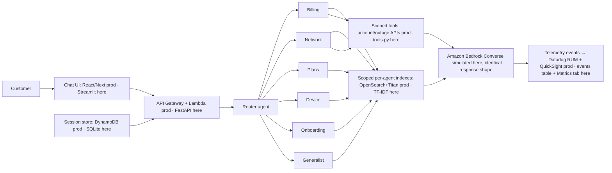

# verizon-agent-demo

A runnable local replica of the **6-agent telecom assistant platform** I built at Verizon — rebuilt as a self-contained teaching demo so every internal decision is *visible*, not just described.

**Read WALKTHROUGH.md first.** It explains every step of one prompt's lifecycle, what an agent is, how routing works, how Bedrock responds, how correctness is measured, how the models are trained, and maps every resume claim to code you can demo live.

## Architecture (as built at Verizon → as simulated here)



## Quick start

```bash
python -m venv .venv && .\.venv\Scripts\activate
pip install -r requirements.txt
python -m uvicorn services.api.main:app --port 8011     # terminal 1
streamlit run services/ui/app.py --server.port 8514     # terminal 2
# open http://localhost:8514
```

Or with Docker (standalone demo; no AWS account or API keys needed):

```bash
docker compose up --build
```

## How to use (self-study loop)

1. Open the **Chat + Trace** tab, paste "why is my bill so high this month".
2. Open each of the 8 trace steps on the right — each names the code file it comes from and carries a one-line Telugu summary.
3. Send "my internet is down in 75024" → watch the router bar chart switch agents and the outage tool fire.
4. Send two related messages in one session → watch stickiness + memory replay.
5. Send "quantum banana therapy" → watch the abstention gate refuse (no model call, no cost).
6. Open **Metrics** tab → this is what the Datadog/QuickSight story looked like.
7. Open **Resume claims map** tab → each bullet with its code location and a live demo move.

## Endpoints

- `POST /chat` — `{text, session_id?}` → answer + citations + tools + full 8-step trace
- `GET /history/{session_id}` — stored turns (memory lives here, not in Bedrock)
- `GET /metrics` — p50/p95 latency, tokens, cost, per-agent volume, abstention rate, feedback
- `POST /feedback` — `{event_id, rating: 0|1}` — becomes eval cases in prod

## Tests

```bash
pytest -q
```

17 tests: router accuracy/clarify/stickiness, scoped retrieval, Bedrock response shape + statelessness proof, session memory + budget, pipeline routing/abstention/event-logging, API end-to-end.
